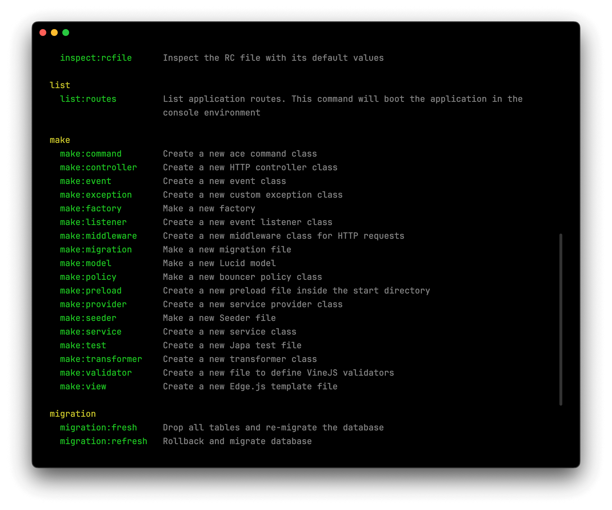

:variantSelector{}

# Command line and REPL

You might be wondering why we're covering CLI and REPL instead of jumping straight into building features. Here's why: throughout this tutorial, you'll constantly use Ace commands to generate controllers, models, and other files. Getting familiar with the CLI now prevents us from interrupting the flow later.

More importantly, the [REPL](../../../guides/ace/repl.md) will become our playground for experimenting with models and databases. When we explore database queries, filters, and relationships in later sections, we'll use the REPL to try things out. It's a throwaway environment that lets us focus on learning concepts without the ceremony of building complete features.

## Exploring available commands

Let's start by seeing what commands AdonisJS gives us. Run this in your terminal.

```bash
node ace list
```

You should see something like this:

:::media

:::

Notice how the commands are grouped together? 
- The `make:*` commands help you generate files.
- The `migration:*` commands help you run and revert database migrations.
- The `db:*` commands handle database seeding, and so on.

Want to know more about a specific command? Just add `--help` to the end. This shows you everything that command can do, including any options you can pass to it.

```bash
node ace make:controller --help
```

## Using the REPL

The REPL will be our experimentation playground throughout the tutorial. Let's explore how to use it by creating and querying users for our DevShow web-app.

### Start the REPL and load models

First, start the REPL:

```bash
node ace repl
```

Once the REPL starts, load all your models using the `loadModels()` helper. The REPL provides several built-in helper functions like this to make experimentation easier. This helper will make all your models available under the `models` namespace.

```ts
await loadModels()

// Access user model
models.user
```

### Create users

Let's use the `User` model (stored within the `app/models/user.ts` file) to create a couple of users that we can use to log into our app later. The `create` method accepts the model properties as an object, persists them to the database and returns a model instance.

```ts
await models.user.create({ fullName: 'Harminder Virk', email: 'virk@adonisjs.com', password: 'secret' })
```

Let's create another user.

```typescript
await models.user.create({ fullName: 'Jane Doe', email: 'jane@example.com', password: 'secret' })
```

### Fetch all users

Now that you have created a couple of users, let's fetch them using the `all` method. This method will execute a `SELECT *` query and returns an array containing both users. Each user is a User model instance, not a plain JavaScript object.

```typescript
await models.user.all()
```

### Find and delete a user

You can find a user with a given ID using the `find` method. The return value is an instance of the User model or `null` (if no user was found).

```typescript
const user = await models.user.find(1)

user.id
// 1

user.email
// 'virk@adonisjs.com'
```

You can delete this user by simply calling the `delete` method on the User instance.

```ts
await user.delete()

user.$isDeleted // true
```

If you list all users again, you should see only Jane remains:

```ts
await models.user.all()
```

### Exit the REPL

When you're done exploring, type `.exit` or press `Ctrl+D` to leave the REPL and return to your terminal.
